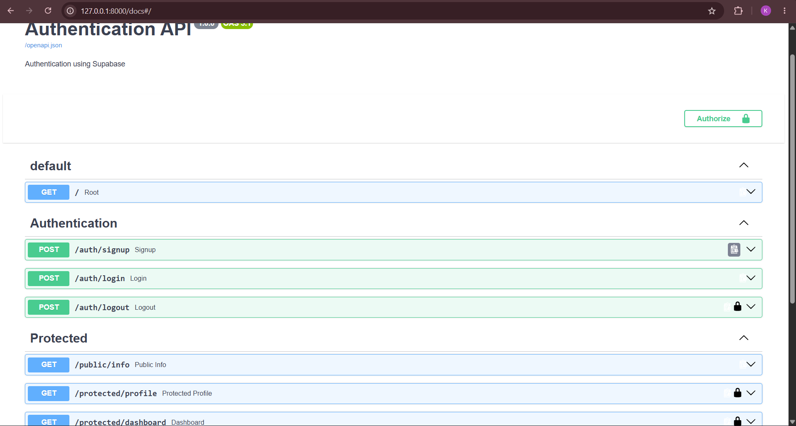

# 🔐 Supabase Authentication API

A secure REST API built using **FastAPI** and **Supabase Auth**.

The project implements user signup, login, logout, JWT authentication, protected routes, and Swagger UI documentation.

## 🚀 Features

- User Signup
- User Login
- User Logout
- JWT Access Tokens
- Protected API endpoints
- Supabase token verification
- Reusable FastAPI authentication dependency
- Swagger UI with Bearer authentication
- Proper HTTP status codes
- Environment variable configuration

## 🛠️ Tech Stack

- Python
- FastAPI
- Supabase Auth
- JWT
- Pydantic
- Uvicorn
- Git & GitHub

## 📁 Project Structure

```text
supabase-auth-api/
│
├── app/
│   ├── dependencies/
│   │   └── auth.py
│   ├── routers/
│   │   ├── auth.py
│   │   └── protected.py
│   ├── schemas/
│   │   └── auth.py
│   └── supabase_client.py
│
├── docs/
│   └── swagger.png
│
├── .env
├── .gitignore
├── main.py
├── requirements.txt
└── README.md
```

> ⚠️ The `.env` file is used locally and must never be committed to GitHub.

## ⚙️ Setup

### 1. Clone the repository

```bash
git clone YOUR_GITHUB_REPOSITORY_URL
cd supabase-auth-api
```

### 2. Create virtual environment

```powershell
python -m venv venv
venv\Scripts\activate
```

### 3. Install dependencies

```powershell
pip install -r requirements.txt
```

### 4. Configure Supabase

Create a `.env` file in the project root:

```env
SUPABASE_URL=your_supabase_project_url
SUPABASE_KEY=your_supabase_anon_key
```

> Never commit `.env` to GitHub.

### 5. Run the server

```powershell
uvicorn main:app --reload
```

Server:

```text
http://127.0.0.1:8000
```

Swagger UI:

```text
http://127.0.0.1:8000/docs
```

## 📋 API Endpoints

| Method | Endpoint | Authentication | Description |
|---|---|---|---|
| GET | `/` | ❌ No | Server health check |
| POST | `/auth/signup` | ❌ No | Register a new user |
| POST | `/auth/login` | ❌ No | Login and receive JWT |
| POST | `/auth/logout` | 🔒 Yes | Logout authenticated user |
| GET | `/public/info` | ❌ No | Public information |
| GET | `/protected/profile` | 🔒 Yes | Get user profile |
| GET | `/protected/dashboard` | 🔒 Yes | Access protected dashboard |

## 🔐 Authentication Flow

```text
Signup / Login
      ↓
Supabase Auth
      ↓
Access Token (JWT)
      ↓
Authorization: Bearer <token>
      ↓
FastAPI
      ↓
Supabase verifies token
      ↓
Protected Resource
```

Protected routes require:

```text
Authorization: Bearer <access_token>
```

Invalid or expired tokens return:

```text
401 Unauthorized
```

## 📊 Status Codes

| Code | Meaning |
|---|---|
| 200 | Successful request |
| 201 | User created |
| 204 | Logout successful |
| 400 | Bad request |
| 401 | Unauthorized |

## 📸 Swagger UI

Swagger UI is available at:

```text
http://127.0.0.1:8000/docs
```

The protected endpoints support Bearer Token authentication using the **Authorize 🔒** button.



## 🔒 Security

- Supabase handles user authentication.
- JWTs are verified before accessing protected routes.
- Authentication logic is implemented as a reusable FastAPI dependency.
- `.env` is excluded using `.gitignore`.
- Supabase credentials are not committed to GitHub.

## 📝 Git Stages

```text
Stage 0: setup server and supabase client
Stage 1: signup and login routes working
Stage 2: public route and unverified protected route
Stage 3: profile route token verification
Stage 4: auth middleware and logout endpoint
Stage 5: Swagger UI documentation with bearer auth
Stage 6: publish to GitHub and write README
```
